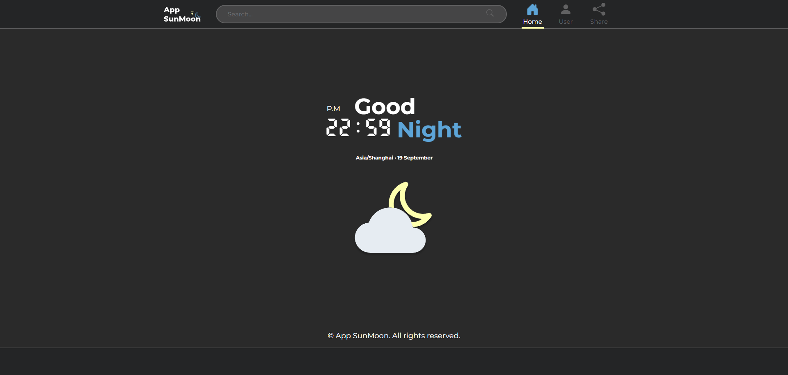

<!-- Improved compatibility of back to top link: See: https://github.com/othneildrew/Best-README-Template/pull/73 -->
<a name="readme-top"></a>
<!--
*** Thanks for checking out the Best-README-Template. If you have a suggestion
*** that would make this better, please fork the repo and create a pull request
*** or simply open an issue with the tag "enhancement".
*** Don't forget to give the project a star!
*** Thanks again! Now go create something AMAZING! :D
-->


<!-- PROJECT SHIELDS -->
<!--
*** I'm using markdown "reference style" links for readability.
*** Reference links are enclosed in brackets [ ] instead of parentheses ( ).
*** See the bottom of this document for the declaration of the reference variables
*** for contributors-url, forks-url, etc. This is an optional, concise syntax you may use.
*** https://www.markdownguide.org/basic-syntax/#reference-style-links
-->

<!-- PROJECT LOGO -->
<br />
<div align="center">
  <a href="">
    
  </a>

  <h3 align="center">SunMoon App</h3>

  <p align="center">
    Conoce la hora a nivel mundial
  </p>
</div>


<!-- ABOUT THE PROJECT -->
## Sobre el proyecto

  <a href="">
    
  </a>

Es un proyecto personal el cual te dice la hora a nivel mundial. Simplemente hay que introducir el país o ciudad en el buscador.

En este proyecto realicé tanto el diseño con así como su desarrollo.

<p align="right">(<a href="#readme-top">back to top</a>)</p>


### Frameworks utilizados

En esta sección expondré los frameworks y librerías utilizadas:

Front:
* React.js
* chart.js
* JavaScript
* Sass
* CSS
* HTML

Back:
* Node.js
* Express
* MongoDB
* Mongoose

<p align="right">(<a href="#readme-top">back to top</a>)</p>


<!-- GETTING STARTED -->
## Inicializando el proyecto

Sigue los siguientes pasos para inicializar el proyecto en local:

Instala las decependencias de NPM:
   ```sh
   npm install
   ```

<p align="right">(<a href="#readme-top">back to top</a>)</p>


<!-- USAGE EXAMPLES -->
## Uso

En esta página web podrás consultar la hora a nivel mundial gracias a la API consumida. Próximamente se añadirán las funcionalidades de login y favoritos.

<p align="right">(<a href="#readme-top">back to top</a>)</p>
